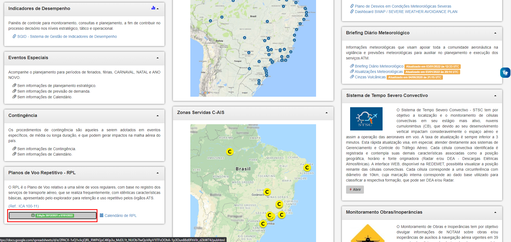
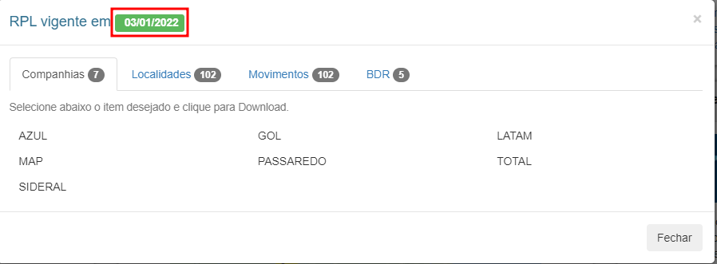

<h1 align="center">
  <br/>
  Lyov API
</h1>

<p align="center">Lyov is a simple API to fetch and parse repetitive flight plans (RPL) from DECEA (Brazilian Air Traffic Control authority), returning a JSON string in the process 😊.<br/><br/>Focus on <b>create</b> you application. The Lyov will take care of
<b>provides</b> to you flight plans of brazilian airlines.
</p>

<p align="center">&nbsp;</p>

<br/>

## Features

✨ JSON format - Much better to use than `TXT` matrix file

⚡ Blazing Fast - A powerful Phoenix API

## 🌻 Motivation

DECEA (Brazilian Air Traffic Control authority) provides flight plans on **TXT file**, is not very easy to use this information on applications to get real routes of specific company, or fetch specific flight plan.

To see a example of default TXT response you can <a target=__BLANK href="http://portal.cgna.decea.mil.br/files/abas/2021-12-30/painel_rpl/companhias/Cia_AZU_CS.txt">click here</a>

Lyov was created just to **convert** flight plans data to **JSON**. 

Here is an example of JSON response.

```json
[
  {
    "aicraft_type": "B734",
    "arrival_icao": "SBEG",
    "callsign": "AZU2002",
    "code": "AZU",
    "cruise_flight_level": "320",
    "cruise_speed": "N0442",
    "departure_icao": "SBKP",
    "enroute_time": "0335",
    "eobt": "1225",
    "flight_days": {
      "friday": false,
      "monday": false,
      "saturday": false,
      "sunday": true,
      "thursday": false,
      "tuesday": false,
      "wednesday": false
    },
    "flight_number": "2002",
    "remarks": "EQPT/SDFGHIRWY/LPBN/B2B3B4B5C1D1O2S1EET/SBAZ0133",
    "route": "UKBEV DCT ASTOB UM417 OBGAT UZ21 ISIPA",
    "wake_turbulence": "M"
  }
]
```
## ⚡️ Quick start
Lyov is **already hosted** and is available at **RapidAPI** 24/7/365. 

**Access RapidAPI in this [link](https://rapidapi.com/andrebrito16/api/lyov1/)** 

You can send a `GET` request to this route replacing `company` and `date` params.

About params:
- Company is ICAO Code of airline, here is a list of supported params for company:
 

| **company param** |  **Name**   |
| :---------------: | :---------: |
|        AZU        |    Azul     |
|        GLO        |     Gol     |
|        TAM        |    Latam    |
|        PAM        |     Map     |
|        PTB        |  Passaredo  |
|        TTL        | Total Cargo |
|        SID        |   Sideral   |

- Date is current cycle of RPL. This is be fetched automatically soon. But for now **you have to** use `&date=2022-01-20` (**This param will always be updated on this readme while not implemented automatically way**).
- You can also access [this link](http://portal.cgna.decea.mil.br/) and scroll to "Plano de Voo Repetitivo - RPL" and click on date. (Image bellow)
  
Then a popup will open and you'll see the date on format `MM/MM/AAAA`. To use on API you have to convert to `AAAA-MM-MM`.



On image above the date is `03/01/2022`, so on API use you will pass `&date=2022-04-30`


## 💙 Contributing

PR's are welcome !

Found a Bug ? Create an Issue.

You can also join on [this discord server](https://discord.gg/DEtGv4wUNX) and chat with us.

## 💖 Like this project ?

Leave a ⭐ If you think this project is cool.

## 👨‍💻 Author

### André Felipe Brito

## ⚠️ License

`Lyov` is free and open-source software licensed under the [MIT License](https://github.com/andrebrito16/lyov/blob/master/LICENSE). Official logo was created by Kewyn Ferreira (ferreira#3479).